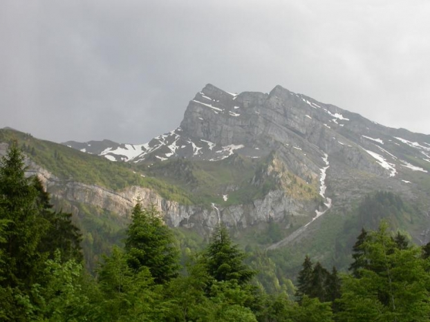
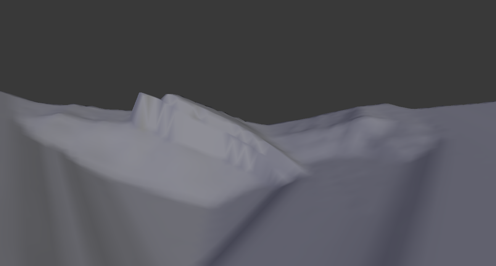
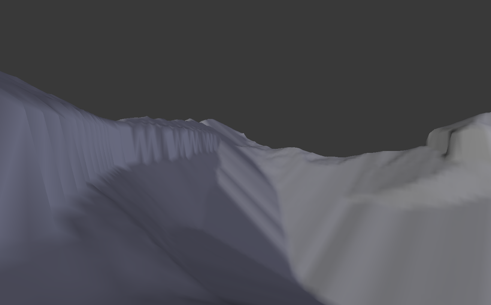

# Udoubtedly GLorYous Terrain

This is a C++ project done for the "Modeling for Videogames" subject during my Master in Image, Development and 3D Technologies. The goal was to implement procedural terrain generation methods.

The application generates a terrain using a Perlin Noise, on which we apply thermal and hydaulic erosion models. The terrain is then populated with fictive vegetal species depending on their needs and the local terrain parameters such as humidity and light exposure.

Three people worked on this project: **BONIS Thomas**, **CREVITS François** and myself, **Hugo RAMBURE**. My principal contribution to this project is the modeling of the thermal erosion of terrains. A layer-based erosion model was implemented during the final iteration to show that the terrain topography is dependent on the underground geological structures.

## Results
The [report](./results/report.pdf) and [defense](./results/defense.pdf) PDF files are available in the ```results/``` folder.

These images show real terrain photos that we compare to the result of the layer-based thermal erosion model on a randomly generated initial terrain.

  
<p align="center"> <b>Picture taken in the Swiss Alps, [Geosciences Montpellier, J. Malavieille, insu.cnrs.fr]</b></p>


  
<p align="center"> <b>Picture taken in the Jura Mountains, [Laboratoire de Geosciences de Lyon / ENS Lyon, Pierre Thomas, planet-terre.ens-lyon.fr]</b></p>


## How to compile the code
The application is Linux only but runs on the Linux Bash Shell for Windows. The project is built using the following commands:
```shell
    mkdir build
    cd build
    cmake ..
    make
```

## Documentation
The documentation uses the Doxygen format and can be compiled using the command:
```shell
    doxygen docTerraGen
```
The documentation file __./doc/html/index.html__ can be opened with your favorite browser

## Running the application
Three applications are built:
- `./build/test` runs all unitary tests
- `./build/genTerrain` runs integration tests
- `./build/genTerrainGraphique` runs the graphics interface
